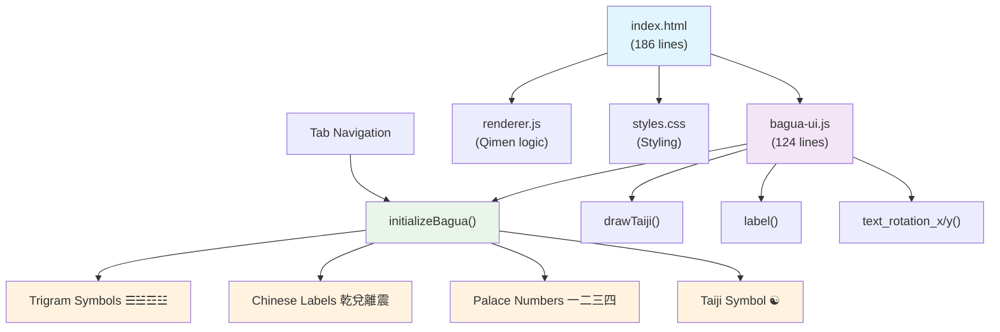

# 奇门遁甲 - 十天干与九宫八卦

A beautiful Electron application for exploring Qimen Dunjia patterns with the Ten Heavenly Stems and Nine Palaces.

## Features

### 奇门遁甲 (Qimen Dunjia) Tab
- **3x3 Grid Layout**: Displays the traditional Qimen grid with positions:
  ```
   4 | 9 | 2 
   3 | 5 | 7
   8 | 1 | 6
  ```

- **六仪 (Six Instruments)**: Uses the sequence 戊己庚辛壬癸
- **三奇 （Three Odds）**：丁丙乙
- **九宫 (Nine Palaces)**: Choose any starting position (1-9)
- **遁甲 (Escapes)**: 阳遁 (Yang Escape) or 阴遁 (Yin Escape)
- **Interactive Grid**: Click on grid cells to set starting position
- **Traditional Table Display**: Shows 六甲, 甲子 series, and 星奇月奇日奇

### 九宫八卦图 (Nine Palace Bagua Diagram) Tab
- **Interactive Bagua Diagram**: Traditional Fuxi Bagua arrangement with D3.js
- **Taiji Symbol**: Central Yin-Yang (☯) symbol with correct traditional colors
- **Eight Trigrams**: All eight trigrams (☰☱☲☳☴☵☶☷) positioned around the center
- **Chinese Labels**: Traditional names for each trigram (乾兌離震巽坎艮坤)
- **Palace Numbers**: Nine Palace numbers (一二三四五六七八九) in their corresponding positions
- **Responsive SVG**: Scalable vector graphics that work on all screen sizes

### General Features
- **Modern UI**: Beautiful, responsive design with smooth animations
- **Tab Navigation**: Easy switching between Qimen and Bagua views
- **Cross-Platform**: Works as Electron app or in modern web browsers

## Installation
1. Clone the project
   ```bash
   git clone <github url>
   ```

2. Navigate to the project directory:
   ```bash
   cd Qimen
   ```

3. Install dependencies:
   ```bash
   npm install
   ```

## Running the App

Start the application:
```bash
npm start
```

For development with logging:
```bash
npm run dev
```

## How to Use

### Basic Usage
1. **选择五遁 (Choose Escape Method)**: 
   - 阳遁 (Yang Escape): Fill grid positions in order 1→2→3→4→5→6→7→8→9
   - 阴遁 (Yin Escape): Fill grid positions in order 9→8→7→6→5→4→3→2→1
2. **选择九宫 (Choose Palace)**: Select any grid position (1-9) as starting point
3. **六仪序列**: Characters always follow the sequence: 戊→己→庚→辛→壬→癸→丁→丙→乙
4. **Fill Grid**: Click "Fill Grid" to place characters
5. **Clear Grid**: Click "Clear Grid" to reset

### Interactive Features
- **Click on Grid Cells**: Click any cell to set it as the starting position and automatically fill
- **Keyboard Shortcuts**:
  - `F`: Fill grid
  - `C`: Clear grid  
  - `1-9`: Set starting position and fill

### Example
**阳遁 (Yang Escape) - Starting Position: 3:**
- 戊 in position 3
- 己 in position 4  
- 庚 in position 5
- 辛 in position 6
- 壬 in position 7
- 癸 in position 8
- 丁 in position 9
- 丙 in position 1 (loops back)
- 乙 in position 2

**阴遁 (Yin Escape) - Starting Position: 4:**
- 戊 in position 4
- 己 in position 3
- 庚 in position 2
- 辛 in position 1
- 壬 in position 9 (loops back)
- 癸 in position 8
- 丁 in position 7
- 丙 in position 6
- 乙 in position 5

## Grid Position Layout

The grid follows the traditional Qimen arrangement:

```
┌─────┬─────┬─────┐
│  4  │  9  │  2  │
├─────┼─────┼─────┤
│  3  │  5  │  7  │
├─────┼─────┼─────┤
│  8  │  1  │  6  │
└─────┴─────┴─────┘
```

## Technical Details

- Built with Electron for cross-platform compatibility
- Modern JavaScript ES6+ features
- CSS Grid for responsive layout
- Smooth animations and transitions
- Console logging for debugging

## Architecture

The application is built with a modular structure, separating concerns between different components:



## File Structure

```
Qimen/
├── package.json          # Project configuration
├── main.js              # Electron main process
├── index.html           # UI layout and tab navigation
├── styles.css           # Styling and animations  
├── renderer.js          # Qimen Dunjia application logic
├── bagua-ui.js          # Bagua diagram functionality
└── README.md           # This file
```

## Browser Compatibility

While built as an Electron app, the HTML/CSS/JS can also run in modern browsers that support:
- CSS Grid
- ES6 Classes
- Modern JavaScript features

A server can be started with the command
```bash
python3 -m http.server 8000
```


Enjoy exploring Qimen patterns!

