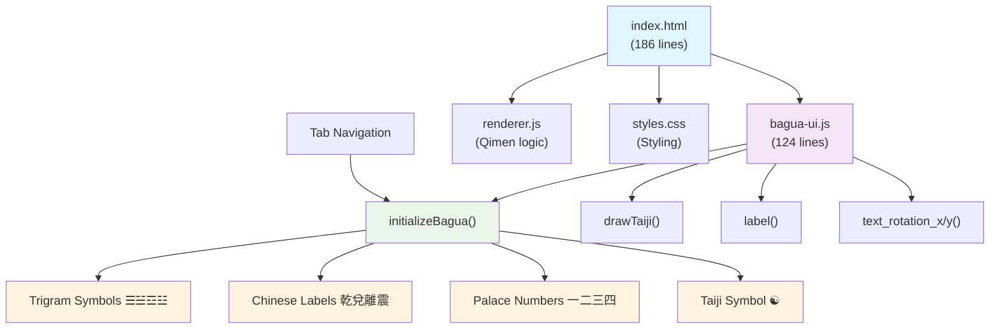

# 奇门遁甲 - 十天干与九宫八卦

A web application for exploring Qimen Dunjia patterns with the Ten Heavenly Stems and Nine Palaces. Opens on the **奇门排盘** tab by default.

## Features

### 奇门遁甲 (Qimen Dunjia) Tab
- **3x3 Grid Layout**: Displays the traditional Qimen grid with positions:
  ```
   4 | 9 | 2 
   3 | 5 | 7
   8 | 1 | 6
  ```

- **六仪 (Six Instruments)**: Uses the sequence 戊己庚辛壬癸
- **三奇 （Three Odds）**：丁丙乙
- **九宫 (Nine Palaces)**: Choose any starting position (1-9)
- **遁甲 (Escapes)**: 阳遁 (Yang Escape) or 阴遁 (Yin Escape)
- **Interactive Grid**: Click on grid cells to set starting position
- **Traditional Table Display**: Shows 六甲, 甲子 series, and 星奇月奇日奇

### 九宫八卦图 (Nine Palace Bagua Diagram) Tab
- **Interactive Bagua Diagram**: Traditional Fuxi Bagua arrangement with D3.js
- **Taiji Symbol**: Central Yin-Yang (☯) symbol with correct traditional colors
- **Eight Trigrams**: All eight trigrams (☰☱☲☳☴☵☶☷) positioned around the center
- **Chinese Labels**: Traditional names for each trigram (乾兌離震巽坎艮坤)
- **Palace Numbers**: Nine Palace numbers (一二三四五六七八九) in their corresponding positions
- **Responsive SVG**: Scalable vector graphics that work on all screen sizes

### 奇门排盘 (Qimen Paipan) Tab ← default landing page
- **时家奇门** with **拆补法** (Chai Bu method)
- Auto-calculates bureau (局数), solar term (节气), duty star (值符/值使)
- Displays all 9 palaces with: 天盘干, 地盘干, 九星, 八门, 八神
- "当前时间排盘" button to generate a chart for right now

### 干支计算 (GanZhi Calculator) Tab
- Calculates the Four Pillars (四柱八字) for any date/time
- Accounts for 立春 year boundary, 24 solar term month boundaries, and 时辰 hour periods
- "此刻干支" button for the current moment

### General Features
- **Tab Navigation**: Easy switching between all four views
- **Runs in any modern browser** — no Electron required

## Installation
1. Clone the project
   ```bash
   git clone <github url>
   ```

2. Navigate to the project directory:
   ```bash
   cd Qimen
   ```

3. Install dependencies:
   ```bash
   npm install
   ```

## Running the App

**Recommended — with hot reload:**
```bash
npx live-server
```
Opens automatically at `http://localhost:8080` and reloads on any file save.

**Alternative — static server:**
```bash
python3 -m http.server 8000
```

**Electron (desktop app):**
```bash
npm start        # production
npm run dev      # with DevTools
```

## How to Use

### Basic Usage
1. **选择五遁 (Choose Escape Method)**: 
   - 阳遁 (Yang Escape): Fill grid positions in order 1→2→3→4→5→6→7→8→9
   - 阴遁 (Yin Escape): Fill grid positions in order 9→8→7→6→5→4→3→2→1
2. **选择九宫 (Choose Palace)**: Select any grid position (1-9) as starting point
3. **六仪序列**: Characters always follow the sequence: 戊→己→庚→辛→壬→癸→丁→丙→乙
4. **Fill Grid**: Click "Fill Grid" to place characters
5. **Clear Grid**: Click "Clear Grid" to reset

### Interactive Features
- **Click on Grid Cells**: Click any cell to set it as the starting position and automatically fill
- **Keyboard Shortcuts**:
  - `F`: Fill grid
  - `C`: Clear grid  
  - `1-9`: Set starting position and fill

### Example
**阳遁 (Yang Escape) - Starting Position: 3:**
- 戊 in position 3
- 己 in position 4  
- 庚 in position 5
- 辛 in position 6
- 壬 in position 7
- 癸 in position 8
- 丁 in position 9
- 丙 in position 1 (loops back)
- 乙 in position 2

**阴遁 (Yin Escape) - Starting Position: 4:**
- 戊 in position 4
- 己 in position 3
- 庚 in position 2
- 辛 in position 1
- 壬 in position 9 (loops back)
- 癸 in position 8
- 丁 in position 7
- 丙 in position 6
- 乙 in position 5

## Grid Position Layout

The grid follows the traditional Qimen arrangement:

```
┌─────┬─────┬─────┐
│  4  │  9  │  2  │
├─────┼─────┼─────┤
│  3  │  5  │  7  │
├─────┼─────┼─────┤
│  8  │  1  │  6  │
└─────┴─────┴─────┘
```

## Technical Details

- Pure HTML/CSS/JS — runs in any modern browser
- D3.js (CDN) for the Bagua diagram
- CSS Grid for responsive layout
- Electron supported but not required

## Architecture

The application is built with a modular structure, separating concerns between different components:


```mermaid
graph TB
    A["index.html<br/>(186 lines)"] --> B["bagua-ui.js<br/>(124 lines)"]
    A --> C["renderer.js<br/>(Qimen logic)"]
    A --> D["styles.css<br/>(Styling)"]
    
    B --> E["initializeBagua()"]
    B --> F["drawTaiji()"]
    B --> G["label()"]
    B --> H["text_rotation_x/y()"]
    
    I["Tab Navigation"] --> E
    E --> J["Trigram Symbols ☰☱☲☳"]
    E --> K["Chinese Labels 乾兌離震"]  
    E --> L["Palace Numbers 一二三四"]
    E --> M["Taiji Symbol ☯"]
    
    style A fill:#e1f5fe
    style B fill:#f3e5f5
    style E fill:#e8f5e8
    style J fill:#fff3e0
    style K fill:#fff3e0
    style L fill:#fff3e0
    style M fill:#fff3e0
```

## File Structure

```
Qimen/
├── package.json          # Project configuration
├── main.js              # Electron main process (optional)
├── index.html           # UI layout and tab navigation
├── styles.css           # Styling and animations
├── renderer.js          # Qimen Dunjia grid logic
├── bagua-ui.js          # Bagua diagram (D3.js)
├── ganzhi.js            # Four Pillars calculator
├── qimen-paipan.js      # 时家奇门 排盘 system
└── README.md            # This file
```

Enjoy exploring Qimen patterns!

